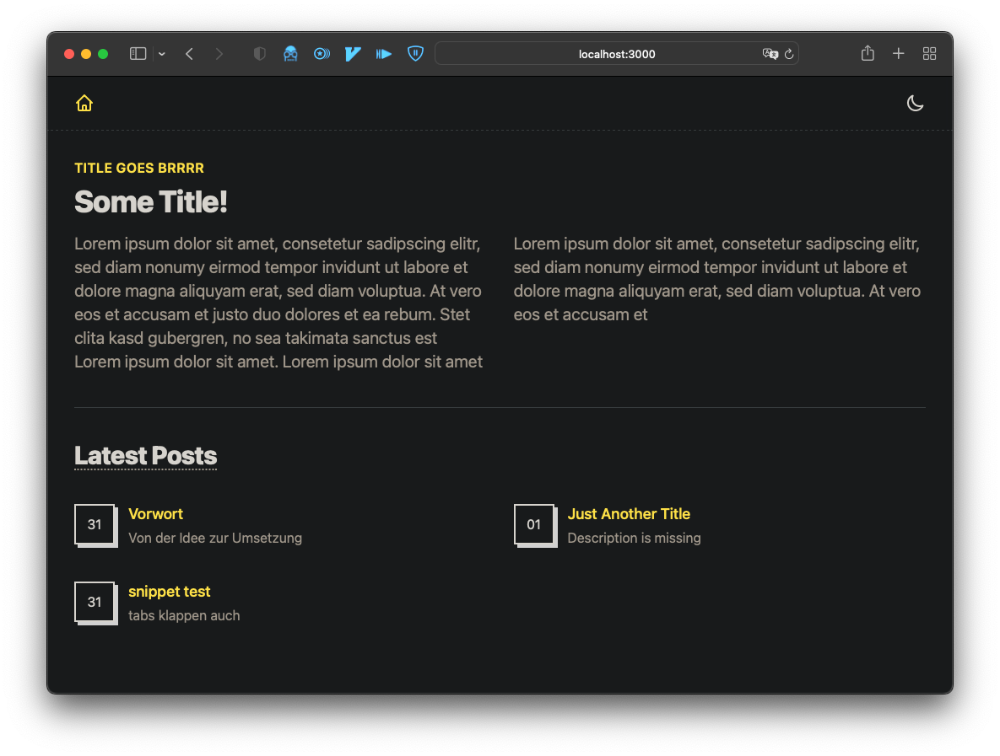

# [VUEJS AMSTERDAM DIARY](https://vuejs.amsterdam/)

## About the Project

Simple [blog](https://amsterdamn.netlify.app/) to capture the experience of [VueJS Amsterdam](https://vuejs.amsterdam/).

### Built With

- [Nuxt3](https://v3.nuxtjs.org/)
- [Nuxt Content](https://content.nuxtjs.org/)
- [Nuxt Color](https://color-mode.nuxtjs.org/)
- [VueUse](https://vueuse.org/)
- [Tailwind CSS](https://tailwindcss.com/)
- [heroicons](https://heroicons.com/)
- [ESLint](https://eslint.org/)
- [Prettier](https://prettier.io/)
- [Pnpm](https://pnpm.io/)
- [Node.js v18](https://nodejs.org/en/)
- [husky](https://typicode.github.io/husky/)
- Blood, sweat & tears

## Getting Started

To get a local instance up and running follow these simple (or not, looking at you Node) steps.

### Requirements & Installation

- [Install Node.js v18 via n](https://github.com/tj/n) or [Install Node.js v18 via nvm](https://github.com/nvm-sh/nvm)
- [Install Pnpm](https://pnpm.io/installation)
- Clone the repo `git clone git@github.com:justpeterpan/amsterdamn.git`
- Install dependencies with `pnpm -i --shamefully-hoist` (Even tho Nuxt3 documentation recommends installing dependencies with the `--shamefully-hoist` option it is [highly discouraged](https://pnpm.io/cli/install#--shamefully-hoist) by Pnpm itself)
- Install husky with `pnpm run prepare`
- Finally start the dev server on http://localhost:3000 `pnpm run dev`

## Contributing

1. Clone Project
1. Create Feature Branch (`git checkout -b feature/name-of-feature-or-post`)
1. Commit changes
   - New Feature: `git commit -m '✨ add new-feature-description'`
   - New Post: `git commit -m '🗒️ add new-post-title'`
   - Bugfix: `git commit -m '🐛 fix bugfix-description'`
   - Refactoring: `git commit -m '🎨 refactor component-or-sth-else-description'`
   - Update: `git commit -m '⬆️ update dependency-name-version'`
   - Documentation: `git commit -m '📝 update documentation-description`'
1. Push to branch (`git push origin feature/name-of-feature-or-post`)
1. Create new pull request

## Roadmap

- [x] Update Readme
- [x] Add `back to home`-Button on Post-Pages
- [ ] Add Image-Component
- [ ] Add Navbar
- [ ] Domain setup
- [ ] Add favicon
- [ ] Add title
- [ ] Netlify Function to block requests from outside of kt vpn or add password protection
